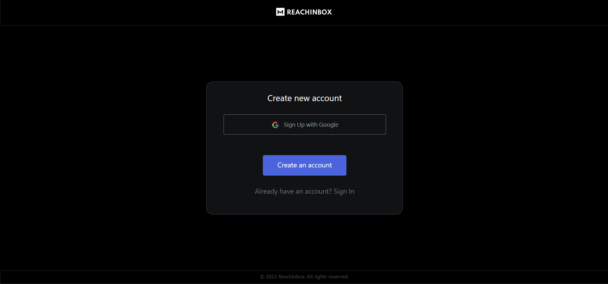
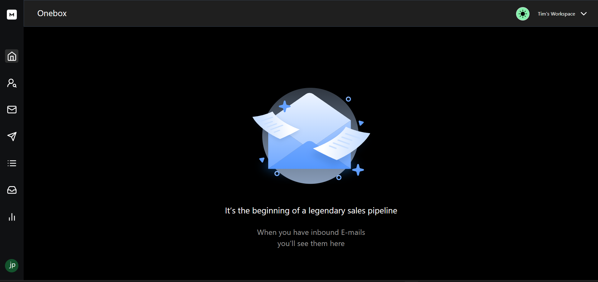
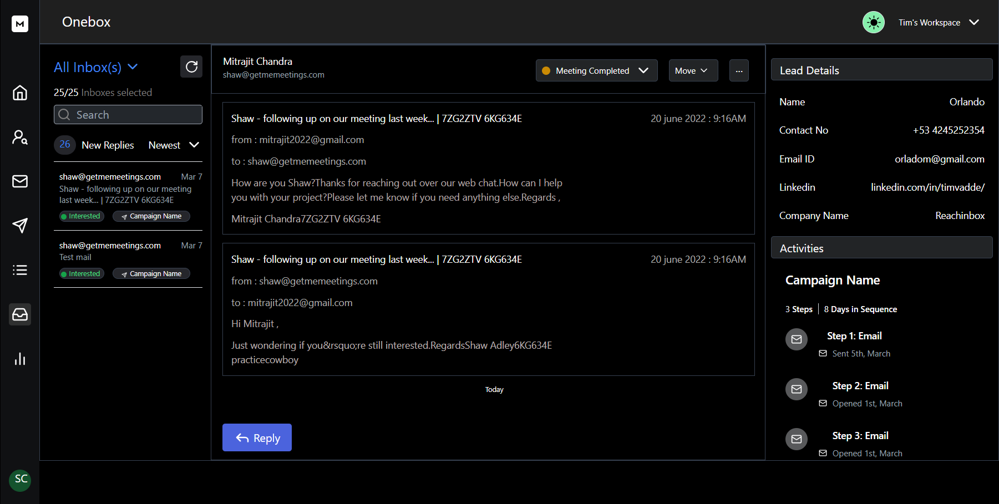
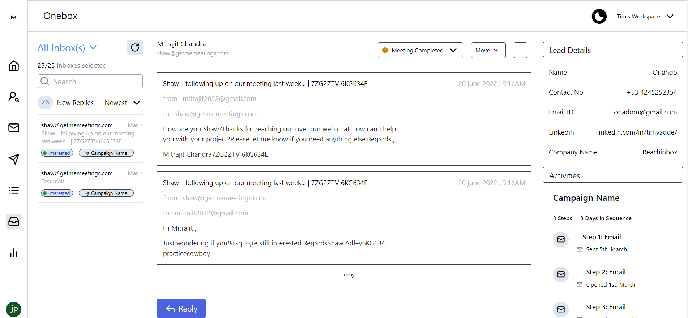
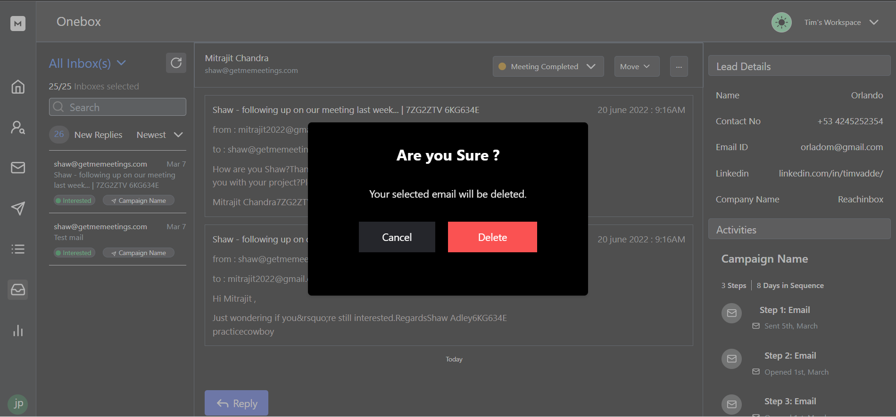

# ReachInBox-Frontend

## Overview
This repository contains the code for Reachinbox frontend  App using React with Typescript for an assignment given by Reachinbox.

## Technologies Used ( Frontend )
  - Typescript
  - React
  - Tailwind css

## Deployment

The application is deployed on netlify and can be accessed [here](https://reachinbox-nishkarsh9.netlify.app/)

## Demo Video :- 
https://www.loom.com/share/b12a1f9ab67e48ae8e90efff18bccc9b?sid=6a306c49-9d1a-4b37-9dfa-21b4538e3831

## Login Page



## Landing Page



## Deshboard with Dark Mode
 


## Dashboard with Light Mode



## Delete Email 




 # How to Run <br/>
 
   <h2>Installation</h2>
   
   Clone the repository:   ``` git clone https://github.com/Nishkarsh9/reachinbox-assignment.git  ``` <br/>
   Navigate to the project directory:   ``` cd reachinbox-assignment ``` <br/>
   Install the dependencies:   ``` npm install ``` <br/>
   Start the development server:   ``` npm run start ``` <br/>
   Open your browser and visit:   ``` http://localhost:3000 ``` <br/>
   

   ## Features 
   
  - Authentication
  - Get Emails
  - Post (send) Email
  - Delete Email


   <h2>Endpoints</h2>
   <h3>All Emails</h3>
   <pre><code>GET {{baseurl}}/onebox/list </code></pre>

   <h3>All Emails from Onebox</h3>
   <pre><code>GET {{baseurl}}/onebox/messages/:thread_id </code></pre>

   <h3>Add Onebox Mail</h3>
   <pre><code>POST {{baseurl}}/onebox/reply/:thread_id </code></pre>

   <h3>Delete Email</h3>
   <pre><code>DELETE {{baseurl}}/onebox/messages/:thread_id </code></pre>